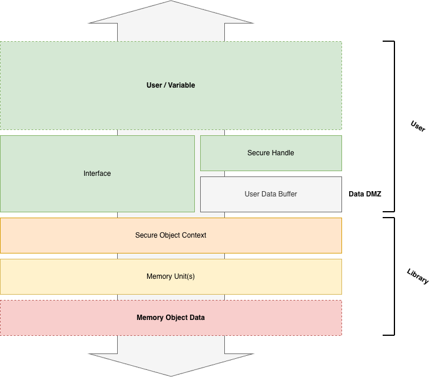

[](https://github.com/lumiwyou/safeheap/actions/workflows/build.yml)

# Safeheap Revamped
Safeheap is a library that mitigates risks against memory objects utilizing a variety of systems such as encryption (see Security Schemes).

## Disclaimer
This library is in early-development and is NOT considered ready for use in production. I bear no responsibility for the use of this software.

## Features
- Developers can delegate a memory variable for storage and protection to the internal system.
- Library interface functions for developers such as `sfp_malloc` and `sfp_free`.
- Security sensitivity classification system (with labels such as `CRITICAL`, `INTERNAL`, `PUBLIC`) which determines the security schemes to be used.
- Internal memory object tracking system.
- Various security schemes such as encryption, fragmentation, "noising", data wiping, and more.

## Usage
```
#include <safeheap.h>
```

### Set up documentation
Simply run the following command and it will generate HTML and LaTeX documentation in the `build/doxygen` directory.
```
doxygen Doxyfile
```

## Security Schemes
The following schemes are employed to secure memory objects.
- [Encryption](###Encryption)
- [Fragmentation](###Fragmentation)
- [Data Wiping](###Data-Wiping)
- Noising <span style="color:orange;">(not implented yet)</span>
- Hashing <span style="color:orange;">(not implented yet)</span>
- Secure key storage <span style="color:orange;">(not implented yet)</span>

### Encryption
Encryption helps uphold [confidentiality](####Confidentiality) through ciphering the memory object [unit](####Memory-Unit)(s) from interpretable plaintext to un-interpretable ciphertext.

### Fragmentation
Fragmentation divides the [memory object](####Memory-Object) unit into smaller chunk units. This measure makes it more difficult for analysis since the entirety of the data is dispersed across the virtual memory space. This measure complements confidentiality.

### Data Wiping
Data wiping ensures confidentiality through the destruction of the memory object unit(s). This measure is usually taken at the end of a data object's life cycle (when it is no longer used).

Data wiping is done through a iterative and often repeated overwrite of the data bits with either zeroes or random data to ensure there are is no data remnance.

### Noising
> Not implemented yet.
### Hashing
> Not implemented yet.
### Secure key storage
> Not implemented yet.

## Architecture


The information flow goes both ways for both read/write operations. `The User Data Buffer (UDB)` is the bridging data buffer between the `Memory Object Data` and the `User / Variable`. The user utilizes the `interface` for interacting with the internal `secure object context(s)` referenced by the `secure handle`.

## Glossary

### Sensitivity

### Secure Object / Secure Object Context
When a user variable is delegated for protection by the library, a secure object is created containing the context for the security operation surrounding that variable. It contains the memory addressing, the sensitivity of the data, and the securiy schemes used to protect this sensitivity.

### Secure Object Handle
```core/secure/secure.h
typedef void * SecureHandle;
```
A handle pointer that points to a shared User Data Buffer (UDB) which also acts as a reference for internal library object-discovery. It is the bridge between the user-space and the context in the library internal space. It is the return value from all interface functions.

### User Data Buffer (UDB)
> [!WARNING]
> The UDB is determined to be the primary attack vector due to the memory object being in its unprotected plaintext form.

A data buffer shared between the library and the user. It is used for transfering data between the two spaces.

#### Memory Object
An object of memory. In a cybersecurity context it would be considered the `information asset`. This object is delegated to and managed internally by the library. It is usually represented by either one or more `Memory Units`.

#### Memory Unit
```core/memory/memory.h
typedef struct {
    unsigned char * address;
    size_t length;
} MemoryUnit;
```

#### Confidentiality
#### Integrity
#### Availability
